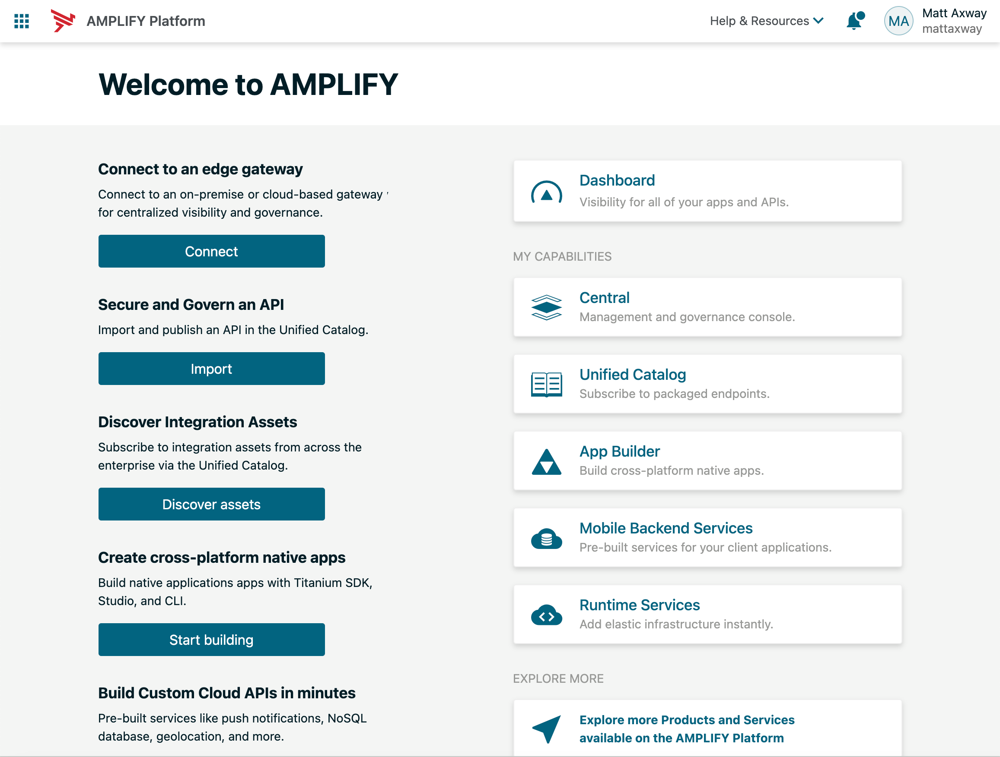
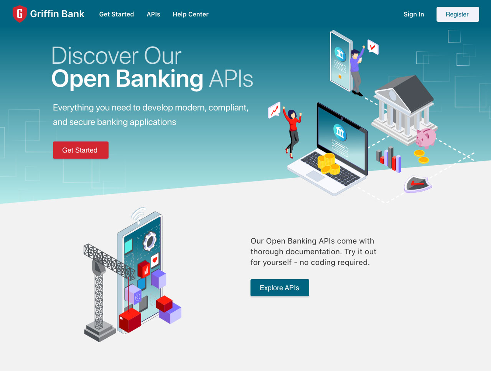
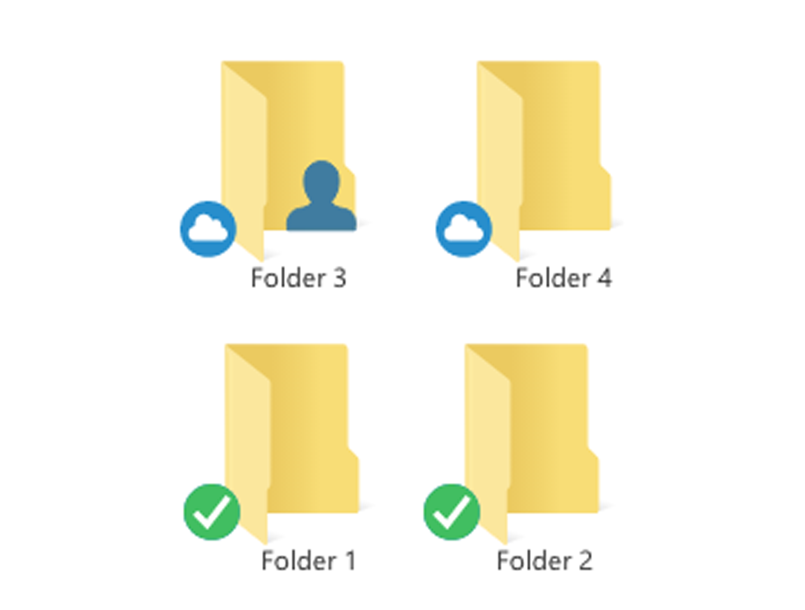

# Welcome
Thanks for visiting. I'm Matt O'Leary, Product Designer. Here are some recent work samples.

  <main class="grid">
    <article>
    
      

        
Refreshed landing pages

        <a href="/landings" class="btn btn-primary btn-block">View</a>
      

    </article>
    <article>
      
      

        
Open Banking demo site

        <a href="/banking" class="btn btn-primary btn-block">View</a>
      
  
    </article>
    <article>
    
      

        
Syncplicity improvements

        <a href="/syncplicity" class="btn btn-primary btn-block">View</a>
      

    </article>
      <!-- <a href="/banking">
    <article>
      
      

        
Open Banking demo site

        <a href="/banking" class="btn btn-primary btn-block">View</a>
      
  
    </article>
    </a> -->
  </main>

